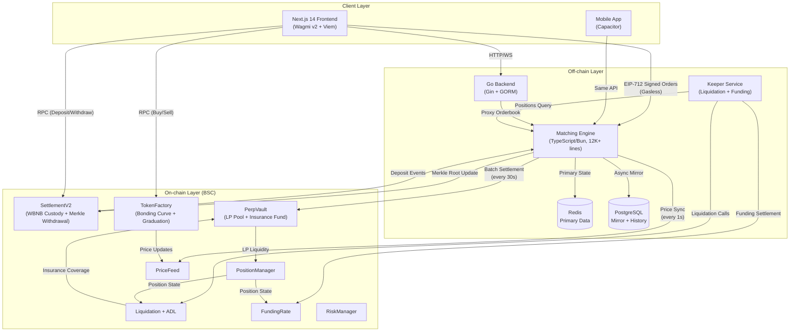
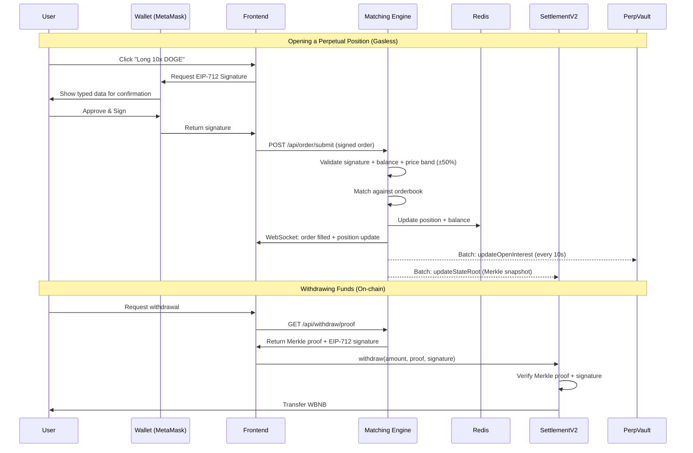
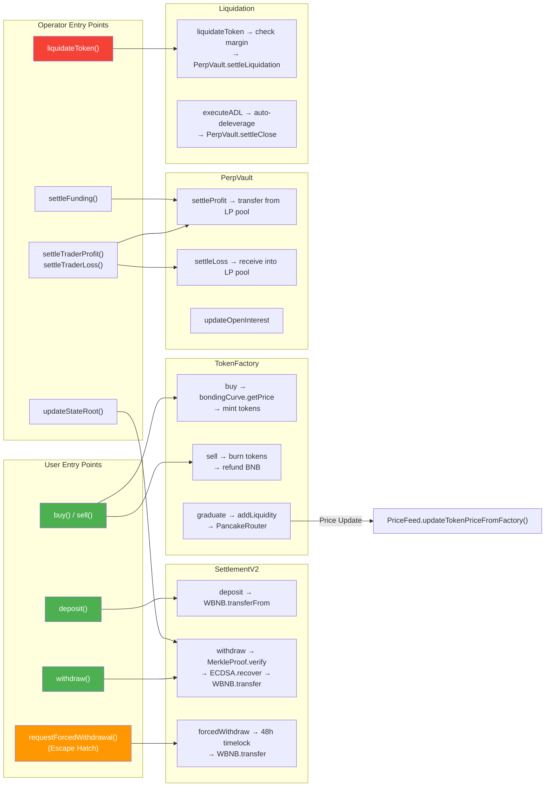
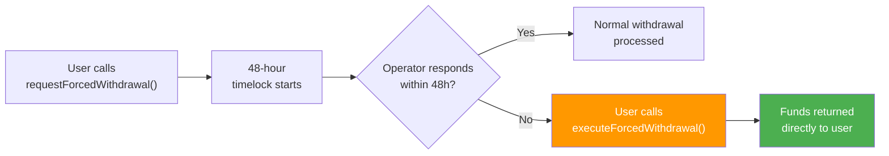

# DEXI

> AI-Built Perpetual DEX for Meme Tokens on BNB Chain

[](https://soliditylang.org/)
[](https://nextjs.org/)
[](https://www.bnbchain.org/)
[]()
[]()
[](LICENSE)

---

## What is DEXI?

DEXI is the first perpetual contract DEX purpose-built for meme tokens. While platforms like dYdX, GMX, and Hyperliquid focus on BTC/ETH, thousands of meme tokens with high volatility have zero derivatives infrastructure. We fill that gap.

**Built entirely by a solo non-developer founder using AI** — 15 smart contracts, a 12,000+ line matching engine, Go backend, and Next.js frontend — all created with AI-assisted development and validated through 4 independent security audits with all 194 issues resolved.

### Key Features

- **Permissionless Perp Markets** — TokenFactory lets anyone launch a meme token and instantly create a perpetual contract market for it
- **CEX-Grade Speed, DEX-Grade Security** — Off-chain matching engine (12,000+ lines TypeScript/Bun) with on-chain settlement via SettlementV2
- **Full Risk Infrastructure** — Liquidation engine, insurance fund, funding rate mechanism, LP vault (PerpVault), price band protection
- **Escape Hatch** — Users can always withdraw funds on-chain even if the off-chain system goes down
- **Integrated Spot + Derivatives** — Token launch, spot trading, and perpetual contracts in one platform

---

## Architecture: Simplified dYdX v3

> Inspired by dYdX v3's hybrid architecture and GMX's PnL calculation model.

### System Architecture



### Data Flow: Order Lifecycle



### Smart Contract Call Graph



---

## Project Structure

```
meme-perp-dex/
├── contracts/                 # Solidity smart contracts (Foundry)
│   ├── src/
│   │   ├── common/            # Shared: PriceFeed, Vault, ContractRegistry
│   │   ├── perpetual/         # V2: SettlementV2, PerpVault, Liquidation
│   │   └── spot/              # TokenFactory, LendingPool
│   ├── test/                  # Foundry tests (373 passing)
│   └── script/                # Deployment scripts
│
├── frontend/                  # Next.js 14 frontend
│   ├── src/
│   │   ├── app/               # Pages: trade, create, earnings, wallet
│   │   ├── components/        # UI: common, spot, perpetual, referral
│   │   ├── hooks/             # React hooks: common, spot, perpetual
│   │   ├── lib/               # Contracts config, stores, utilities
│   │   └── config/            # API endpoints
│   └── messages/              # i18n: en, zh, ja, ko
│
├── backend/
│   ├── src/matching/          # TypeScript matching engine (Bun, 12000+ lines)
│   ├── src/spot/              # Spot trading backend
│   └── internal/              # Go backend: API + Keeper (liquidation, funding)
│
├── stress-test/               # 400-wallet soak test + liquidation verification
├── scripts/                   # Market maker, deployment, E2E test scripts
├── docs/                      # Documentation (audit reports, architecture)
└── docker-compose.yml         # PostgreSQL + Redis + services
```

---

## Tech Stack

| Layer | Technology |
|-------|-----------|
| **Smart Contracts** | Solidity 0.8.20, Foundry, OpenZeppelin |
| **Frontend** | Next.js 14, TypeScript, Wagmi v2, Viem, TailwindCSS |
| **State Management** | TanStack Query, Zustand 5 |
| **Matching Engine** | TypeScript + Bun runtime, WebSocket, Redis |
| **Backend Services** | Go 1.22+, Gin, GORM |
| **Database** | PostgreSQL + Redis |
| **Chain** | BSC Testnet (Chain ID 97) |
| **Charts** | TradingView Lightweight Charts |
| **i18n** | next-intl (EN, ZH, JA, KO) |

---

## Smart Contracts

### Core Contracts

| Contract | Description |
|----------|-------------|
| `SettlementV2.sol` | User WBNB custody + Merkle proof withdrawal + escape hatch |
| `PerpVault.sol` | LP pool + insurance fund + OI management |
| `TokenFactory.sol` | Meme token launchpad with bonding curve |
| `Liquidation.sol` | Position liquidation + ADL |
| `FundingRate.sol` | 8-minute funding rate settlement |
| `PriceFeed.sol` | Oracle price feed for all supported tokens |
| `InsuranceFund.sol` | Protocol insurance fund |
| `RiskManager.sol` | Risk parameter management |
| `ContractRegistry.sol` | Contract address registry |

### Key Design Decisions

- **PnL Calculation**: GMX standard — `delta = size * |currentPrice - avgPrice| / avgPrice`
- **Liquidation Price**: Bybit standard — `liqPrice = entryPrice * (1 - 1/leverage + MMR)`
- **Funding Rate**: 8-minute settlement intervals with configurable base rate
- **Fee Structure**: Taker 0.05% (5bp) / Maker 0.03% (3bp)
- **LP Profit Cap**: Max single-trade profit = LP pool value × 9%
- **Price Band**: Limit orders rejected if >±50% from spot price
- **Slippage Protection**: Mandatory `minAmountOut` on all swap/trade functions

### Deployed Contracts (BSC Testnet — 2026-03-27)

| Contract | Address |
|----------|---------|
| TokenFactory | `0xB40541Ff9f24883149fc6F9CD1021dB9C7BCcB83` |
| SettlementV2 | `0xF83D5d2E437D0e27144900cb768d2B5933EF3d6b` |
| PerpVault | `0xF0db95eD967318BC7757A671399f0D4FFC853e05` |
| PriceFeed | `0xB480517B96558E4467cfa1d91d8E6592c66B564D` |
| PositionManager | `0x50d3e039Efe373D9d52676D482E732FD9C411b05` |
| Vault | `0x7a88347Be6A9f290a55dcAd8592163E545F05e2a` |
| Liquidation | `0x5B829938d245896CAb443e30f1502aBF54312265` |
| FundingRate | `0x3A136b4Fbc8E4145F31D9586Ae9abDe9f47c7B83` |
| InsuranceFund | `0xa20488Ed2CEABD0e6441496c2F4F5fBA18F4cE83` |
| RiskManager | `0x19C763600D8cD61CCF85Ff8d00D4D5e06914F12c` |
| ContractRegistry | `0x0C6605b820084e43d0708943d15b1c681f2bCac1` |
| WBNB | `0xae13d989daC2f0dEbFf460aC112a837C89BAa7cd` |
| PancakeRouter V2 | `0xD99D1c33F9fC3444f8101754aBC46c52416550D1` |

> Source of truth: `deployments/97.json`

---

## Quick Start

### Prerequisites

- Bun runtime (for matching engine)
- Node.js 18+ & pnpm (for frontend)
- Foundry (`curl -L https://foundry.paradigm.xyz | bash`)
- Go 1.22+ (for keeper services)
- Docker (for PostgreSQL + Redis)

### Install

```bash
# Clone
git clone https://github.com/whha111/meme-perp-dex-v4.git
cd meme-perp-dex-v4

# Start infrastructure
docker-compose up -d  # PostgreSQL + Redis

# Contracts
cd contracts && forge install && forge build

# Frontend
cd frontend && pnpm install

# Matching Engine
cd backend/src/matching && bun install
```

### Development

```bash
# Start matching engine
cd backend/src/matching && bun run server.ts

# Start frontend dev server
cd frontend && pnpm dev

# Start Go backend
cd backend && go run cmd/server/main.go

# Run contract tests
cd contracts && forge test -vvv
```

---

## Security Measures

### OpenZeppelin Standard Library

All contracts are built on [OpenZeppelin Contracts](https://www.openzeppelin.com/contracts), the industry-standard audited library:

| Guard | Contracts Using It | Purpose |
|-------|-------------------|---------|
| `ReentrancyGuard` (`nonReentrant`) | SettlementV2, PerpVault, TokenFactory, Vault, Liquidation, FundingRate, InsuranceFund, PositionManager, LendingPool, MemeTokenV2 | Prevent reentrancy attacks on all state-changing functions |
| `Ownable` / `Ownable2Step` | All 15 contracts. SettlementV2 uses `Ownable2Step` (two-step ownership transfer) | Access control for admin functions |
| `Pausable` (`whenNotPaused`) | SettlementV2, PerpVault, TokenFactory, Vault, Settlement, LendingPool | Emergency circuit breaker — pause all user operations |
| `AccessControl` (RBAC) | MemeTokenV2 | Role-based minting permission (MINTER_ROLE) |
| `EIP712` + `ECDSA` | SettlementV2, Settlement | Typed structured data signing for gasless order submission and withdrawal authorization |
| `MerkleProof` | SettlementV2 | On-chain Merkle tree verification for trustless withdrawals |
| `ERC20` + Extensions | MemeTokenV2 | `ERC20Burnable`, `ERC20Permit`, `ERC20Capped` — standard token with burn, gasless approve, and supply cap |

### Reentrancy Protection

Every function that transfers ETH/WBNB or modifies balances is protected with `nonReentrant`:

```solidity
// Example: PerpVault.sol — ALL settlement functions are nonReentrant
function settleTraderProfit(address trader, uint256 profitETH)
    external onlyAuthorized nonReentrant { ... }

function settleTraderLoss(address trader, uint256 lossETH)
    external payable onlyAuthorized nonReentrant { ... }

// Example: TokenFactory.sol — buy/sell protected against reentrancy
function buy(address tokenAddress, uint256 minTokensOut)
    external payable nonReentrant whenNotPaused { ... }

function sell(address tokenAddress, uint256 tokenAmount, uint256 minETHOut)
    external nonReentrant whenNotPaused { ... }
```

Additionally, all contracts follow the **CEI (Checks-Effects-Interactions) pattern** — state updates happen before any external calls, providing defense-in-depth even beyond the `nonReentrant` modifier.

### Fund Safety: Escape Hatch

Users can always recover their funds even if the off-chain system goes completely offline:



### Additional Security Measures

| Measure | Implementation |
|---------|---------------|
| **Slippage Protection** | Mandatory `minAmountOut` / `minTokensOut` on all swap and trade functions |
| **Price Band** | Limit orders rejected if >±50% deviation from spot price (`PRICE_BAND_BPS`) |
| **LP Profit Cap** | Single-trade profit capped at 9% of LP pool value — prevents pool drainage |
| **Authorized Contracts Only** | PerpVault and Vault use `onlyAuthorized` modifier — only whitelisted contracts can call settlement functions |
| **Two-Step Ownership** | SettlementV2 uses `Ownable2Step` — ownership transfer requires explicit acceptance by new owner |
| **Funding Rate Safeguard** | Liquidation check uses actual collateral vs maintenance margin, not fixed initial margin rate |
| **FOK Pre-check** | Fill-or-Kill orders verify available size before matching — prevents partial fills then rollback |

### Audits

Four rounds of audits completed. **194 issues found → 194/194 resolved (0 remaining).**

| Audit | Date | Scope | Findings | Status | Report |
|-------|------|-------|----------|--------|--------|
| V1 Architecture | 2026-03-01 | Fund flow, on/off-chain consistency | 48 | All Fixed | [Report](docs/ISSUES_AUDIT_REPORT.md) |
| V2 Code Review | 2026-03-03 | Line-by-line code review, security | 75 | All Fixed | [Report](docs/CODE_REVIEW_V2.md) |
| V3 Full Audit | 2026-03-04 | Full-stack audit + fix verification | 56 | All Fixed | [Report](docs/AUDIT_V3_FULL.md) |
| V4 Industry Benchmark | 2026-03-31 | Benchmark vs. mature exchanges + bugs | 15 | All Fixed | [Report](docs/V4_INDUSTRY_BENCHMARK.md) |

373 contract tests passing. See [DEVELOPMENT_RULES.md](DEVELOPMENT_RULES.md) for complete fix history.

---

## Environment Variables

See `.env.example` for a complete template. Key variables:

```bash
# Frontend (.env.local)
NEXT_PUBLIC_MATCHING_ENGINE_URL=http://localhost:8081
NEXT_PUBLIC_API_URL=http://localhost:8080
NEXT_PUBLIC_CHAIN_ID=97
NEXT_PUBLIC_SETTLEMENT_ADDRESS=0xF83D5d2E437D0e27144900cb768d2B5933EF3d6b

# Matching Engine (.env)
RPC_URL=https://data-seed-prebsc-1-s1.binance.org:8545/
CHAIN_ID=97
SETTLEMENT_ADDRESS=0xF83D5d2E437D0e27144900cb768d2B5933EF3d6b
MATCHER_PRIVATE_KEY=0x...
```

> **Warning**: Never commit `.env` files. See `.gitignore` for excluded patterns.

---

## Documentation

| Document | Description |
|----------|-------------|
| [DEVELOPMENT_RULES.md](DEVELOPMENT_RULES.md) | Development standards, formulas, audit fix log |
| [docs/ARCHITECTURE.md](docs/ARCHITECTURE.md) | System architecture overview |
| [docs/SETTLEMENT_DESIGN.md](docs/SETTLEMENT_DESIGN.md) | V2 Settlement dYdX-style design |
| [docs/API_SPECIFICATION_V2.md](docs/API_SPECIFICATION_V2.md) | V2 API specification |
| [docs/AUDIT_V3_FULL.md](docs/AUDIT_V3_FULL.md) | V3 full codebase audit |
| [docs/V4_INDUSTRY_BENCHMARK.md](docs/V4_INDUSTRY_BENCHMARK.md) | V4 industry benchmark audit |
| [docs/PRD.md](docs/PRD.md) | Product Requirements Document |

---

## The AI-Native Story

This entire platform was built by a solo non-developer founder using AI as the primary development tool. No traditional coding experience — just deep domain knowledge of derivatives trading and persistent iteration with AI assistants over months of development.

The result: a production-grade perpetual DEX with 15 smart contracts, 12,000+ line matching engine, and 4 passed security audits — proving that AI-native development can produce institutional-quality DeFi infrastructure.

---

## Roadmap

### Phase 1: DEXI Core Infrastructure ✅ Complete

> Meme token perpetual DEX — the foundation layer for everything that follows.

| Milestone | Status |
|-----------|--------|
| 15 smart contracts deployed on BSC Testnet | ✅ All verified on BscScan (12/12) |
| 4 independent security audits | ✅ 194 issues found → 194/194 resolved |
| Matching engine (12,000+ lines TypeScript) | ✅ GMX replay tested (8,869 real trades) |
| SettlementV2 + Merkle proof withdrawal + escape hatch | ✅ Live |
| PerpVault LP pool + liquidation + funding rate + insurance fund | ✅ Full risk infrastructure |
| Next.js 14 trading frontend (spot + perpetual, 4 languages) | ✅ Deployed |
| 373 contract tests passing | ✅ Go/TS compile clean |
| Docker production deployment + SSL | ✅ VPS running |
| Referral system (2-tier, 30% fee sharing) | ✅ Implemented |

### Phase 2: BSC Mainnet Launch

- BSC Mainnet deployment — contracts already audited 4x, direct migration
- opBNB integration — high-frequency trades on L2, lower gas costs
- AA Wallet + Paymaster — zero-friction onboarding, gas sponsored

### Phase 3: AgentX — AI Agent Platform

> **Every AI Agent is a Token. Every chat drives hype.**

AgentX builds an AI chat layer on top of DEXI. Users interact through natural language, and all trading is powered by DEXI's existing infrastructure.

- Fork LobeChat + integrate DeepSeek V3 — conversational interface
- Intent parsing via Function Calling — natural language to trade orders
- Create AI agent → auto-mint token via TokenFactory
- Agent marketplace & leaderboard
- Capacitor packaging — iOS/Android app

### Phase 4: Ecosystem Expansion

- Agent API — third-party DApps can embed AgentX agents
- BNB Greenfield — decentralized storage for agent training data
- Copy trading — follow top agent creators' strategies

> Full AgentX development plan: [docs/AgentX_Development_Plan.docx](docs/AgentX_Development_Plan.docx)

---

## Repository History

This is the latest active repository. The project went through multiple iterations during development, with each version representing a major architectural milestone:

| Version | Repository | Description |
|---------|-----------|-------------|
| V1 | [meme-perp-dex](https://github.com/whha111/meme-perp-dex) | Initial architecture — smart contracts + basic matching engine |
| V2 | [meme-perp-dex-v2](https://github.com/whha111/meme-perp-dex-v2) | SettlementV2 + Merkle proof withdrawal + PerpVault LP pool |
| V3 | [meme-perp-dex-v3](https://github.com/whha111/meme-perp-dex-v3) | Full-stack audit fixes (56/56 resolved) + stress testing |
| **V4 (Current)** | [meme-perp-dex-v4](https://github.com/whha111/meme-perp-dex-v4) | Industry benchmark fixes + production deployment + DEXI rebrand |

**Why migrate?** Each version involved significant architectural changes (contract redesigns, new settlement system, security hardening) that warranted a clean repository to maintain clear git history and avoid confusion during audits. All historical code and commit history is preserved in the previous repositories for reference.

---

## License

MIT License - See [LICENSE](LICENSE) for details.
